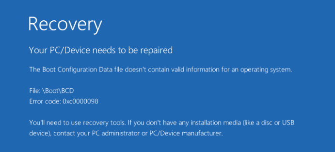

# Macbook Pro Triple Boot

## Introduction

This guide describes what I needed to do in order to successfully triple boot MacOS, Windows 10 and Ubuntu 16.04 LTS on my Macbook Pro 13" (early 2015). At the time of this writing, the latest LTS Ubuntu version available is 18.04; however, I found that using a kernel version later than 4.4 caused my screen to incessantly flicker. As a result, I used 16.04.1, which is the latest minor LTS release that supports 4.4, [according to Ubuntu](https://wiki.ubuntu.com/Kernel/Support). Previous releases of Ubuntu can be obtained [here](http://old-releases.ubuntu.com/releases/).


## Mac OS

This is by far the easiest part. You may need to do nothing at all, because Mac OS is already installed on the machine. But if you need a fresh install:

1. Reboot the machine
2. Press and hold Command+R as the chime sounds
3. Follow the instruction to format your SSD and install a fresh copy of Mac OS

## Install Windows

Using Bootcamp, partition the drive such that the BOOTCAMP partition size is actually the combined size of the Windows and Ubuntu partitions. For example, if you have a 250 GB SSD, and you want to allocate 40 GB for Mac OS, 120 GB for Windows and 90 GB for Ubuntu, then set the size of the BOOTCAMP partition to 210 GB.

## Create the partition for Ubuntu

If you're familiar with the Ubuntu installer, you'll know that it provides a tool to partition the Windows boot manager with a simple slider that allows you to choose the disk sizes of each partition. This did not work for me. Instead, create the ubuntu partition as follows:

1. Boot into the Windows partition
2. Click the Start Menu
3. Type "Disk Management"
4. RIght click the Bootcamp partition and select Shrink Volume
5. Shrink to the desired size. 

Continuing with the example from the previous section, in which we gave the BOOTCAMP partition 210 GB, we can now shrink that to 90 GB so that we can install the Ubuntu partition.

## Install Ubuntu

Make sure your Ubuntu USB is plugged in. Restart the Macbook and hold the option key, booting into the live USB. When prompted on how to partition your disk, click "Something Else". Find the shrunk volume from the previous section, and add the following 3 partitions:

1. swap area (512 MB, Primary Volume)
2. / (10 GB, Logical Volume)
3. /home (the rest, Logical Volume)

And then continue with the installation as normal.

## Install rEFInd

In order to be able to boot into all partitions easily, you need to install the rEFInd boot manager, which can be found [here](www.rodsbooks.com/refind) Reboot your machine and hold the option key, then boot into Mac OS and log in. 

1. Download rEFInd from the link above
2. Extract it into your desired directory
3. Reboot your machine and hold Command + R to boot into Recovery Mode
4. Open Utilities -> Terminal
5. Navigate to the location of the extracted rEFInd files
6. Run ./refind-install

Now when the machine is restarted, you should see some duplicated icons for your installed operating system, not all of which boot into your desired OS. Which brings us to the next section: 

## Repairing the Windows boot manager

If you are able to boot into Windows fine after this step, you can ignore this section. But, if you are hit with the "Recovery: Your PC/Device needs to be repaired" screen shown below, then stick around.



The fix is simple, copied verbatim from [here](https://askubuntu.com/questions/650194/repair-windows-boot-loader-after-installing-ubuntu-on-macbook-pro):

1. Boot to Ubuntu. (You can also do this from OS X, but you'd need to install gdisk and use a different disk device filename.)
2. Open a Terminal window.
3. Type sudo gdisk /dev/sda. After you're prompted for your password, gdisk should launch and tell you, among other things, MBR: hybrid.
4. Type p to view the partition table. Assuming you know enough about your partitions, you should be able to verify that you're looking at the right disk. If not, type q to quit and try another disk device.
5. Type x to enter the experts' menu.
6. Type n to create a fresh protective MBR to replace your existing hybrid MBR.
7. Type p again to verify that your partitions are all still in place. This is just a precaution to ensure you didn't accidentally hit the wrong key.
8. Type w to save your partition table. You'll be asked to verify this action. Do so.

And you're done!

## Hiding Unused rEFInd Icons

Reboot your machine, and you will see a lot more icons than you need, whereas you just want one per installed OS, or 3 in total. The fix is simple: just navigate to the icon of choice and hit the `-` key. It won't delete anything, it'll just hide it.

## Customizing Ubuntu

This section is entirely subjective, but here's what I like to do with my Ubuntu installation:

### Fonts

Download the following fonts:

1. [saxMono](https://www.fontsquirrel.com/fonts/saxmono)
2. [IBM VGA8](https://int10h.org/oldschool-pc-fonts/fontlist/)
3. [Source Code Pro](https://www.fontsquirrel.com/fonts/source-code-pro)

Also, you can copy over some fonts from the Windows partition (I do this for Consolas and Segoe UI)

### Themes

Unfortunately, it seems that most gtk3 themes from [gnome-look.org](https://www.gnome-look.org) don't work on Ubuntu 16.04 out of the box. Luckily, my favourite theme, Numix, is available in the Ubuntu repositories:

```sudo apt install numix-gtk-theme```

### Icons

Faenza Ambience, which is available in the Ubuntu repositories:

```sudo apt install faenza-icon-theme```

### Unity Tweak Tool

Currently I like the settings to be as follows:

1. 12 for monospace
2. 10 for all others. 
3. Text Scaling at 0.90
